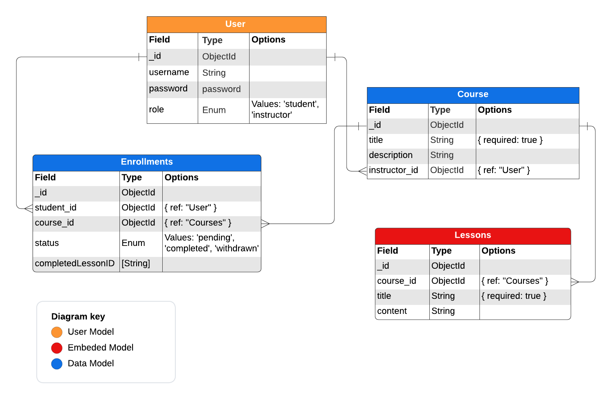

# LMS (Front-End)
## Deployment Link

## Project Description
This project is a Learning Management System (LMS) that allows users to create, read, update, and delete courses. Users can also enroll in courses and view their course progress. The project is built using React, Node.js, Express, and MongoDB.

## Screenshots
### Home Page

### Sign Up Page

### Course List Page

### Course Page

## User Stories
- As a user I expect to to have a signup form that includes a username, password, and a role.
- As a user I want to sign in once my account is created.
- As a instructor user I would like to create courses with titles, description, and lessons.
- As a instructor user I want to create, delete, edit, and read any course added.
- As a instructor user I expect to see which student have completed my course.
- As a student user I won’t be able to create, delete, and edit any course
- As a student user I expect to read the course form which is title, description, and lesson.
- As a student user I want to have a button which says I completed this course.
- As a student user I would like to see progress that says if I completed this course or not.

## Psuedo Code
### Authentication
- function signup that contains and username, password, role
- Const saveUser (username, hashedpassword, role) return that user registered.
- Function signin that contains an username and password.
- If user username and password is correct sign in the user, if not print a message that’s says invalid credentials.

### Course Management
- Function createCourse if (userRole == instructor ID) user can use crud form else the user can read only.
- Function enterCourse if (userRole == student ID) user can register in courses and every lesson inside any course needs to have a completed button.
- Add CRUD in the courses and lessons to give the instructor the ability to create a new one.

### Progress Tracking
- Function completedLesson if the student lesson is completed return lesson completed.
- Function completedCourse if all the lessons are completed return completed course.

## Wireframes

## ERD Model

## Technologies Used
- React
- Node.js
- Express
- MongoDB

## Future Enhancements
- Add a link to My Courses page that allows instructor to view the courses they have created.
- Add a link to My Progress that allows students to view the courses they have enrolled in.
- Add a feature that allows users to search for courses.
- Add categories for the courses and allows users to filter courses by category.
- Add a feature that allows users to rate courses.
- Add a feature that allows users to leave comments on courses.

## Link to Back-End Repository
[Back-End Repository](https://github.com/yusufhj/LMS_back-end)

